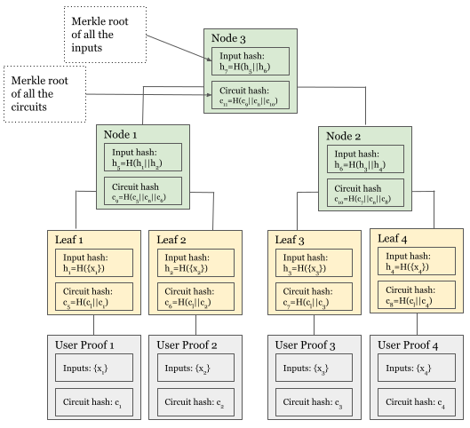
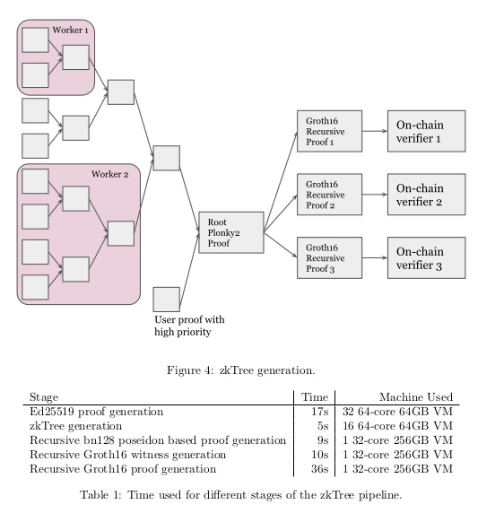
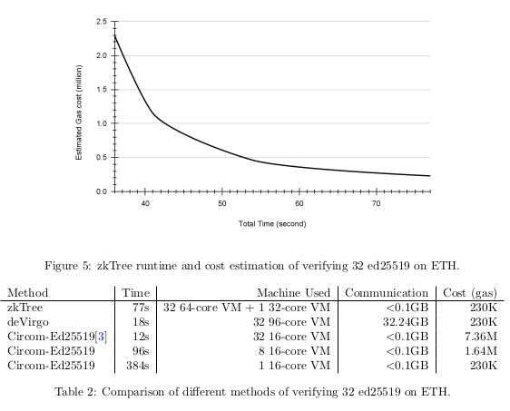

# zkTree: A Zero-Knowledge Recursion Tree with ZKP Membership Proofs

# **1 Page Summary:**

## **Message**

This paper provides a framework for constructing a tree by recursively verifying children’s zero knowledge proofs and outlines a construction pipeline that allows building and on-chain verification with constant gas cost and low data processing pipeline overhead.

## **Highlights**

* Introduces zkTree structure and prototyping of zkTree recursive proving pipeline to enhance prover performance and reduce verification cost.
* Advocates distributing proof generation across different machines and recursively composing proofs through tree.
* Prover can obtain nearly unbounded computation power and rapid proving speed.
* Author does not discuss private inputs in this paper.

## **Result**

* Prover time decreases while on-chain verification cost increases.
* Time can be further reduced by dividing Plonky2 ed25519 circuit into sub-circuits.
* Thousands of zkps can be recursively composed and verified on-chain using Merkle membership proofs in appx one minute at cost of around 230K gas within a single Groth16 proof.
* Can be optimized further in future.

## **Authors**

Sai Deng and Bo Du at Polymer Labs.

# Background

## Zero-Knowledge Proofs

Non interactive ZK system consists of:

* Prover: Aims to demonstrate that they executed some computation with some public input x and some secret input w.
* Prover can then send a proof generated from some public trusted arithmetic circuit such that Computation C done by Prover P through inputs(pub,private witnesses) results in proof pi. \
  C: P (x, w) → π
* Verifier: Verifier can then prove it by V(x, pi) = true/false without knowing the witness w. If computation complexity is greater than verification complexity, computation has been compressed from verifiers perspective,

## Recursive ZKP

Recursive ZKP verifies some zk proofs inside of the circuit.

* Prover proves that they verified some inner proofs with public input x and private witnesses.   \
  P (x1 , π1 , x2 , π2 , ...) → π.
* Proving circuit implements constraints of ZK proof verifiers for inner proofs.
* When the verifier verifies the outer proofs, inner proofs are considered to be true.
* Can be used to generate parallel proofs, thus distributing work amongst different computers or nodes.
* Breaking the larger circuit into smaller circuits will yield significant performance gains.
* Authors have used Plonky2 to implement zkTree.

## Tendermint Light Client

* Tracks consensus state of a blockchain without maintaining complete state.
* Light clients allow different blockchain protocols to communicate with each other without needing a third party.
* ZkTree can reduce on-chain computation of executing light clients.

# zK-Tree

* Tree structure where each node represents a zk proof.
* Each parent node recursively verifies its childrens zk proofs.
* Allows distribution of on-chain costs compared to single instance.
* If the root node is verified, all included proofs are also verified on-chain.
* Three types of proofs form a zkTree:
1. User proof  𝛑
2. Leaf proof ⱱ
3. Node proof ⱳ

## Working

Each user proof is associated with a unique verifier data VD. It can be generated by various circuits or configurations.

Distinct leaf proofs are produced by Lead circuits of the same scheme.

Node proofs are generated by Node circuits in the same Zk Scheme.

User executes computation to generate a proof with some public input x and verifier data VDi

Pi ({xi }) → πi , VDi

Then the leaf builder verifies the proof with other inputs to generate a leaf proof. \
Li (πi , {xi }, VDi ) → υi , hi , ci

In above eq, ci = H(VDl ||VDi ) where VDl is a hash of verifier data of leaf circuit and hi is hash of all the user proofs public inputs.

- ( ci ): This is the result or output of the hash function.

- ( H ): This represents the hash function itself.

- ( VDl ) and ( VDi ): Verifier data VDi and verifier data of leaf circuit VDl

- ( || ): This symbol denotes concatenation, meaning you're joining ( VDl ) and ( VDi ) together into a single string or sequence before passing them into the hash function.

In simpler terms, you're taking ( VDl ) and ( VDi ), joining them together, and then running them through a hash function to get a result, ( ci ).

So, circuit N would verify 2 input proofs in the node circuit. First would be a hash of all proofs and second would be a hash of all circuits.

When implemented through Plonky2 the hash of verifier data can be replaced by circuit hash.

The circuit hash and the input hash computed in the root node corresponds to markle root of all circuit hashes and public inputs.

Circuit hashes verify the security of the circuits.

# On-Chain Verification

* Plonky2 proofs are costly when verified on-chain within EVM.
* 2 Steps that are expensive are:
  * Evaluation of PLONK custom gate constraints.
  * Verification of FRI protocol.
* Because of the reason above, the author suggests a method to recursively prove Plonky2 proof into a Groth16 proof.
* For recursively proving a ZKP, the complexity is the sum of prover and verifier complexities.
* To optimize the Groth16 circuit and reduce overall proving time, the author introduces an intermediate Plonky2 proof utilizing a Poseidon-based hash function over a pairing-friendly field within the Plonky2 prover.

# Distributed Proof Generation

* Theoretically, zkTree generation time is equal to log(n) times the time required to prove a node proof, plus the time needed for transmission of a node proof between workers. Here, n represents the number of user proofs.
* The total communication cost is n times the size of a proof. For a Plonky2-based zkTree construction, the size of a proof is approximately 130 KB.
* Depending on load size, multiple nodes can be spawned by different workers.
* If some proof is high priority, it can be configured such that it is incorporated at shallow depth compared to other proofs.
* The Groth16 circuit used to verify Plonky2 proof can be divided into multiple sub-circuits.
* Division into sub-circuits increases verification costs but reduces prover time.

# Results and Conclusion

